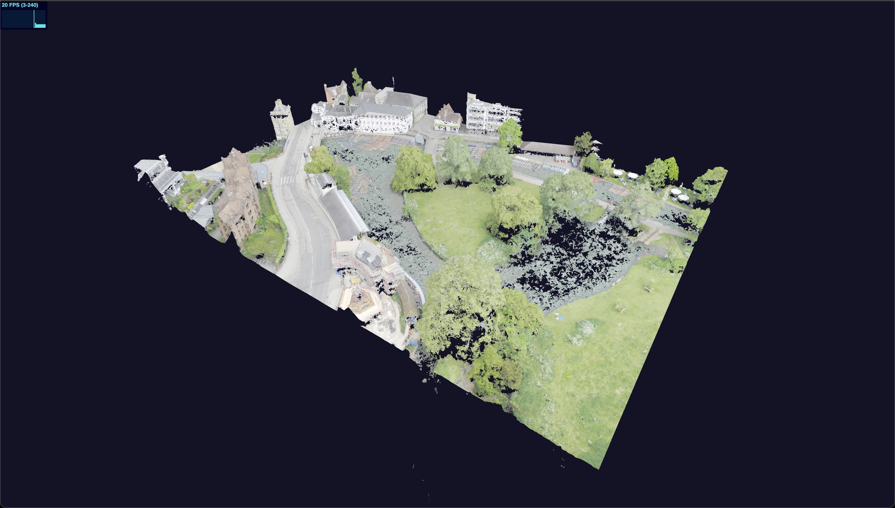

# Sensat Full Stack Viz Take Home Test



## Running the application

To run the Angular app, open a terminal at the `app` folder and run

```sh
$ npm install
# or
$ yarn install
```

then

```sh
$ npm run start
# or
$ yarn start
```

To run the API, open a terminal at the `api` folder and run

```sh
$ npm install
# or
$ yarn install
```

then

```sh
$ npm run dev
# or
$ yarn dev
```

At this point you should now be able to visit `http://localhost:4200/` and see the demo point cloud load

## Instructions

1. Implement the compulsory extension.
2. Pick any one of the further extensions that you feel most comfortable with, and implement it.
3. You are free to change the existing code as much or as little as you see fit.
4. If you feel an extension is unclear, you are free to make a choice as to how to resolve that uncertainty.
5. Document your thoughts in this README.

   For ideas, you might write about:
   - Any design decisions you made
   - Any alternative implementations you considered
   - Why you chose a specific solution
   - Any requirements you felt were unclear and why you chose to resolve them a certain way
   - Anything you wanted to or did change about the existing code
   - How you might further optimise the application to scale to much larger data sets

## Compulsory extension

The app should allow the user to switch to "Blueprint" mode when they press the "B" key.

"Blueprint" mode helps engineers assess a model's relative scale and layout without the distortion of perspective projection. This mode should bring the user to a centred orthographic top-down view of the loaded model and only allow panning. Pressing the "B" key again should return the user to the view they were previously on.

## Further extensions (no particular order)

### Option 1

The app loads very slowly as we are sending all of the data in one giant GLB file.

Instead, use the raw data from the CSV files with the same name to provide that data to the frontend across multiple smaller requests. You are free to transfer the data however you choose. Once you have done so, transform the data from your chosen format to an array of `Point` objects as expected by the `loadRawPoints` function and use that function instead of `loadGltfAsync` to visualise the data.

There are two provided data sources:

- A smaller point cloud for development and testing.
- A larger point cloud you should aim to be able to render.

You can change the data source to the larger file for testing at the top of `map.component.ts` by setting it to `BIG_CLOUD`

### Option 2

The app needs to allow the user to take measurements in the real world.

When the user clicks on two points, the user should be shown the distance between those two points. The renderer assumes that one unit in space is one meter and the point cloud data is in the same format. We aren't worried about your UI design skills, so logging the distance to the console is sufficient. The system should allow the user to make multiple measurements, such that clicking on four points (`A`, `B`, `C`, and `D`) should return two distance measurements (`A <-> B`, and `C <-> D`).

### Option 3

The app should help users present their model to stakeholders.

Wire up the number keys to switch between preset camera angles of the model (e.g., 1: top view, 2: bottom view, 3: three-quarter view, 4: side view, etc.). Pressing the "S" key should also play or pause an automatic spinning of the camera around the model.
